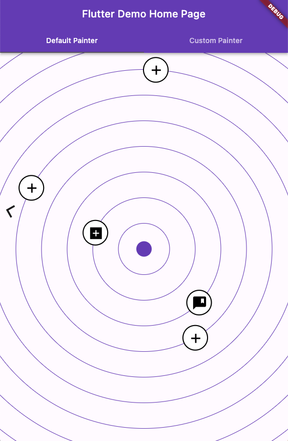

Simple Radar View for Flutter''



## Getting started

TODO: List prerequisites and provide or point to information on how to
start using the package.

## Usage

```dart
List<Spot> spots = [
    Spot(distance: 100, icon: Icons.add_box_sharp),
    Spot(distance: 150, icon: Icons.comment_bank),
    Spot(distance: 200),
    Spot(distance: 250),
    Spot(distance: 300),
    Spot(distance: 350),
  ];

@override
  Widget build(BuildContext context) {
    return Scaffold(
      body:
        RadarView(
          spots: spots,
        ),
      ),
    }
```
